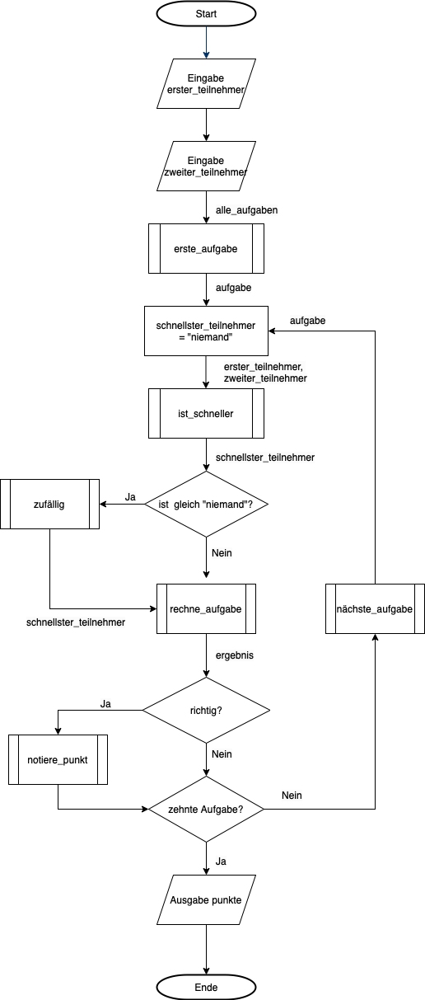

# 2.) Ein Rechenprogramm mal anders
 
## a.) Du als Rechenmaschine
 
1. Wir benötigen zwei Freiwillige.
2. Stellt Euch nebeneinander auf!
3. Wer zuerst seine Hand hebt, ist an der Reihe.
4. Falls sich beide gleichzeitig melden, wählen wir zufällig eine Person.
5. Es gilt rundenweise die folgenden Rechenaufgaben zu lösen:
 
 
|Nummer|Aufgabe|
|------|-------|
|0|`4+4=?`|
|1|`3*3=?`|
|2|`3*7=?`|
|3|`42-2=?`|
|4|`5*3=?`|
|5|`15:3=?`|
|6|`33:3=?`|
|7|`5*10=?`|
|8| `60:6=?`|
|9|`7*4=?`|
 
## b.) Der Algorithmus des Programms
 
Das folgende Diagramm beschreibt die Abfolge von Schritten, die wir durchgeführt haben. Eine solche Abfolge in Form einer Handlungsvorschrift heißt auch Algorithmus.
 
 

 
1. Gehe das Diagramm Schritt für Schritt durch und beschreibe es mit Deinen eigenen Worten!
2. Was könnten die einzelnen Symbole (Raute, Rechteck, usw.) bedeuten?
 
## c.) Das Programm in Python
 
1. Öffne den Quellcode des Programms [rechnen.py](./Code/rechnen.py)
2. Gehe das Programm Zeile für Zeile durch und versuche es zu verstehen
3. Welche Kontrollstrukturen kannst du erkennen?