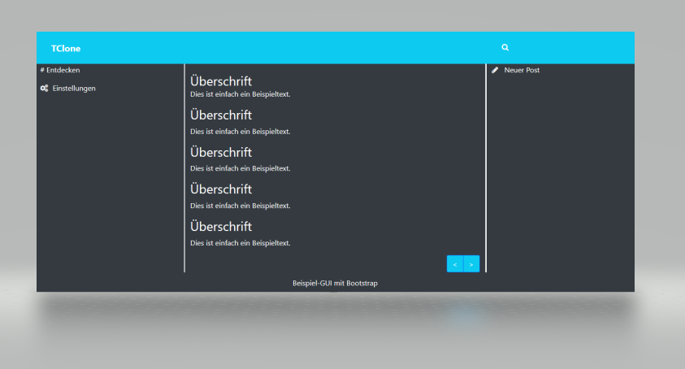

# Projektvorstellung
 
Im Laufe des Code Camps werden wir einen Clone eines bekannten sozialen Netzwerks erstellen. Das folgende Bild zeigt eine graphische Beispieloberfläche (GUI) einer Web-Anwendung:
 

 
Die Oberfläche wurde mit Hilfe von Bootstrap erstellt.